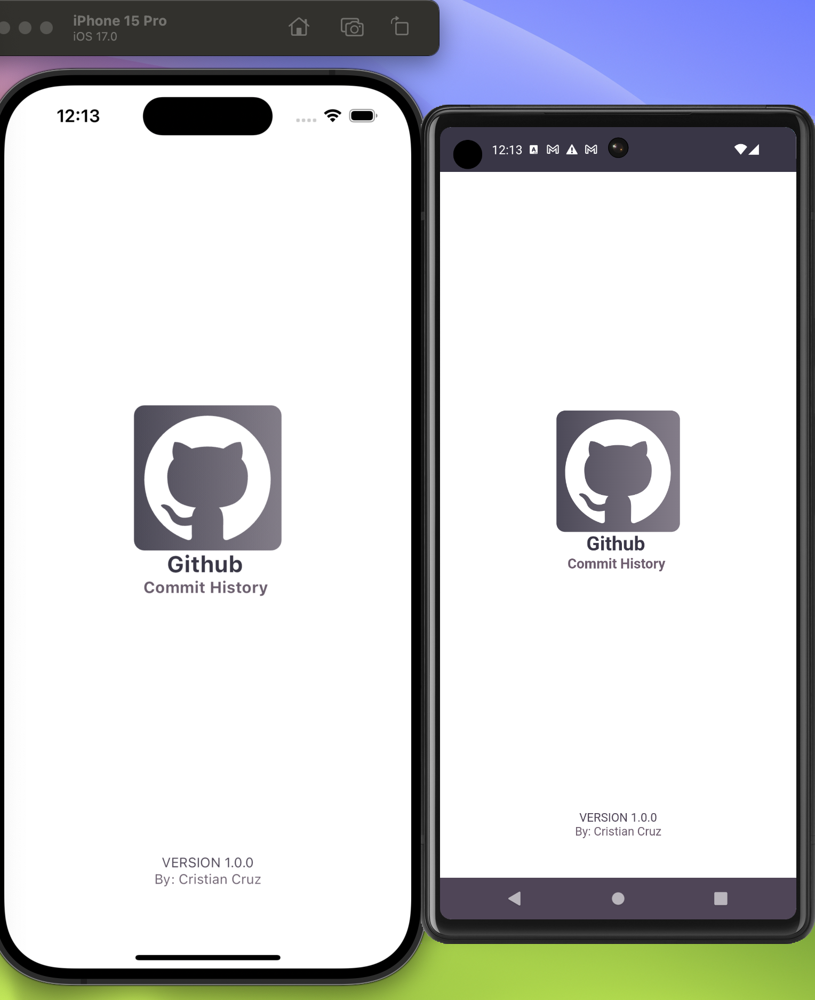
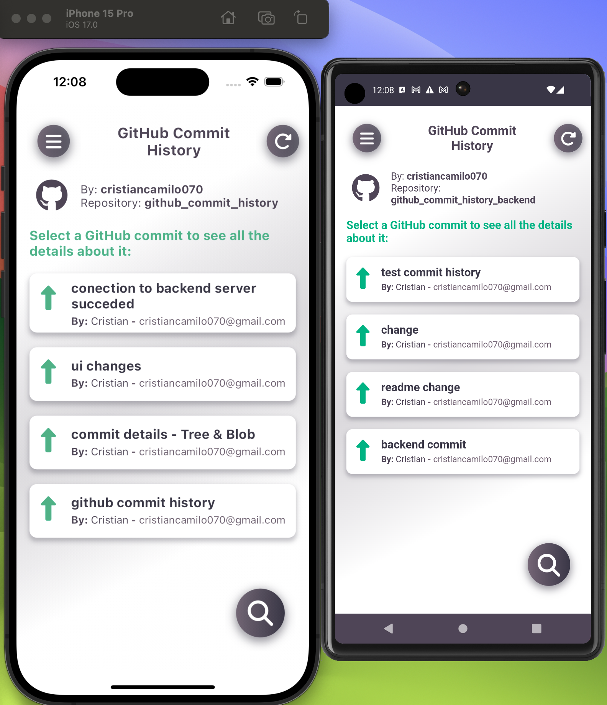
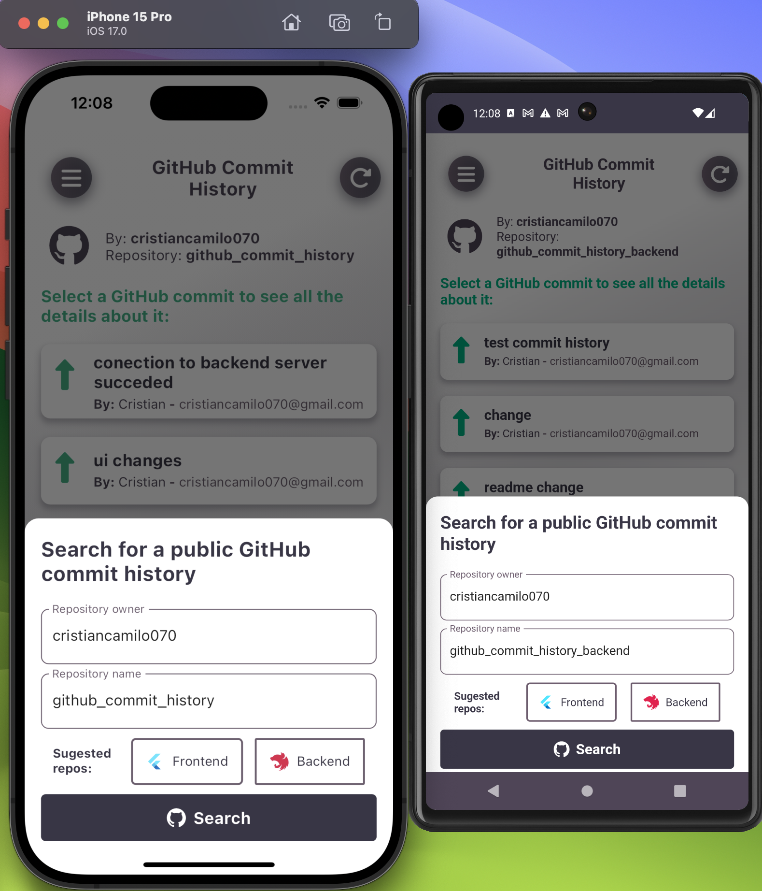
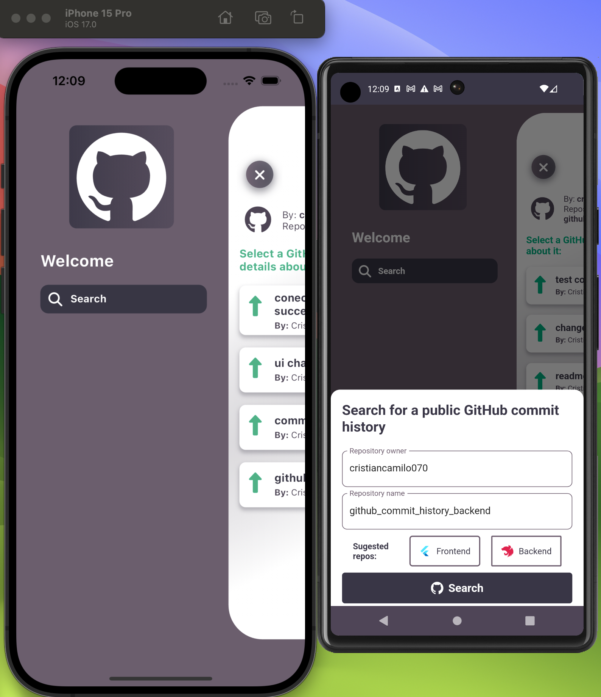
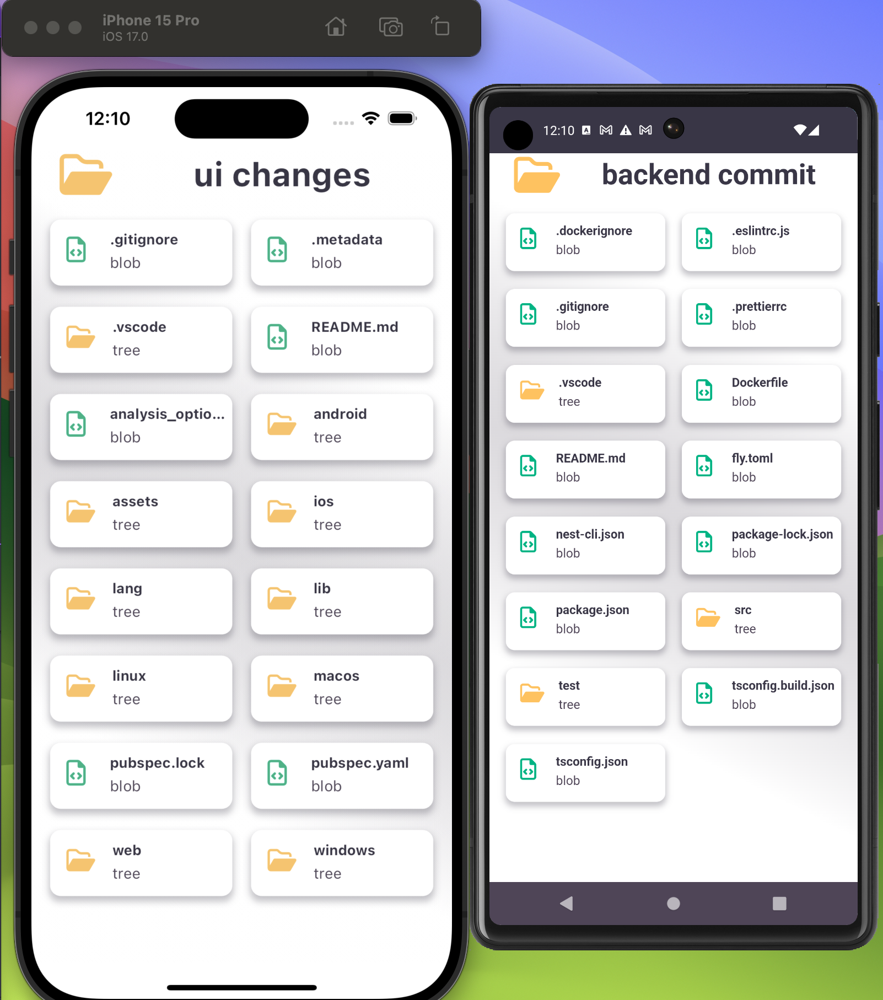
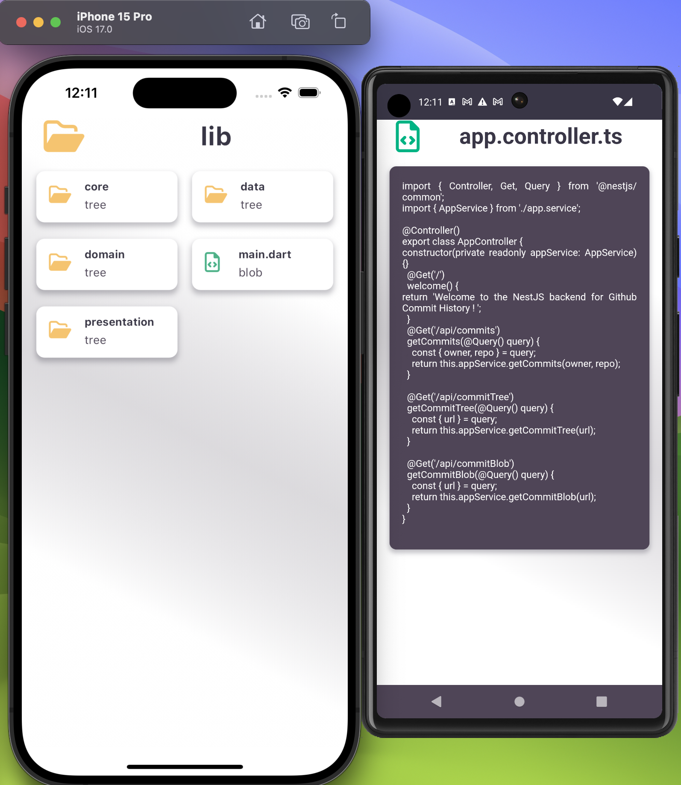
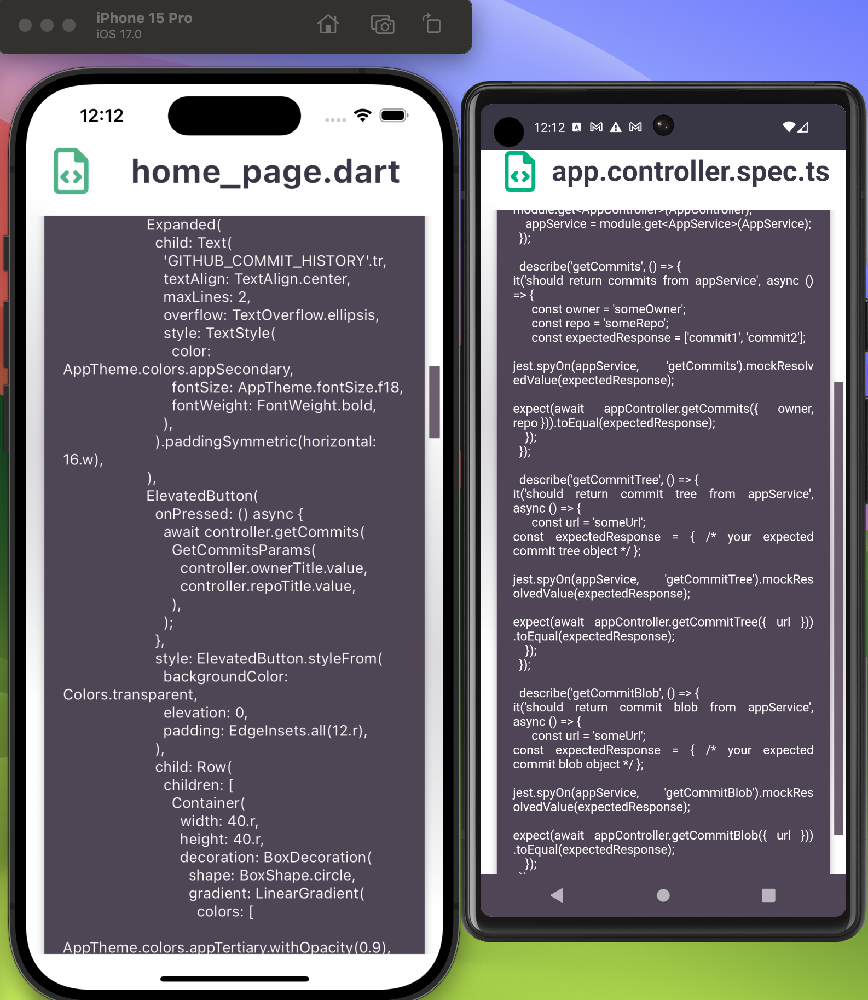

# GitHub Commit History

GitHub Commit History is a project with both frontend and backend components. This section provides details about the both.

  
  
  
  
  
  
  
  
  

# Frontend Overview

  
  

  
  

  
  

  

## Clean Architecture and Code

This Flutter frontend follows the principles of Clean Architecture and Clean Code, providing a structured and maintainable codebase.

## Additional Features

### Snackbar Notifications

The app includes Snackbar notifications to provide users with important information or updates.

### Splash Screen

A Splash Screen is implemented to enhance the user experience by displaying a visual indication that the app is loading.

### Default App Language

The app automatically detects the device language and sets it as the default language, ensuring a seamless experience for users in their preferred language.

## User Functionality

### Search Repositories

Users have the ability to search for various repositories, allowing them to discover and explore a wide range of public repositories.

### Public Repositories

The app provides access to public repositories, enabling users to view details and information about repositories that are publicly available.

### Suggested Repositories

Users are presented with suggested repositories, helping them discover interesting and trending projects within the GitHub community.

## Backend Overview

The backend uses NestJS, a robust framework for building scalable server-side applications. It features dependency injection, middleware, and a modular structure.

### Deployment

- The backend is deployed using [Fly.io](https://github-commit-history-backend.fly.dev/), a platform that simplifies deployment and ensures a reliable hosting environment. [Fly.io](https://github-commit-history-backend.fly.dev/) allows for easy scaling and efficient handling of server resources.

- Source code is available on [GitHub](https://github.com/cristiancamilo070/github_commit_history_backend).

### Technologies Used

- **NestJS Framework:**
  - Efficient and scalable server-side applications.
  - Adheres to Clean Architecture principles.

### Endpoints

Backend provides endpoints for tasks and user authentication.

- **/api/commits:**

  - GET: Retrieves a list of commits.

- **/api/commitTree:**

  - GET: Retrieves commit tree information.

- **/api/commitBlob:**
  - GET: Retrieves commit blob information.

Explore the backend repository for implementation details and structure.

## Possible Errors

If you encounter the "Unexpected error connecting to the server" message, the server might be a bit slow. We recommend waiting a few seconds and trying again or refreshing the page.

If the issue persists, consider running the project locally. Download the backend project [GitHub](https://github.com/cristiancamilo070/github_commit_history_backend) and run the command "npm run start". Once it's running, go to the `github_provider.dart` file in your Flutter project. Look for the comment `//TODO IN CASE SERVER FAILS`, uncomment it, and comment out the one that wasn't previously commented. This step is necessary in case there is no response from the server.

Another factor that could affect the app is the GitHub API request limit. If you exceed this limit, you'll need to add your access token. To do this, go to `github_provider.dart`, find the comment `//TODO IN CASE YOU EXCEEDED THE GITHUB API REQUEST LIMIT PUT YOUR TOKEN HERE`, uncomment it, and add your token. This is also a precautionary measure in case of exceeding the GitHub API request limit.
